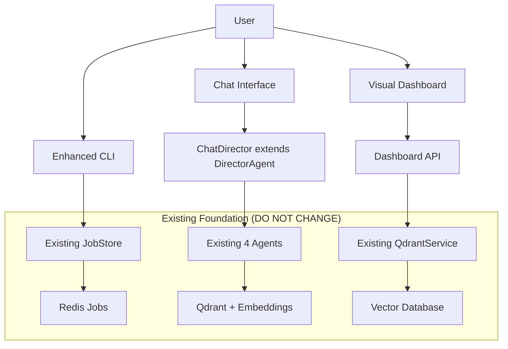

# PRP: Human Control Interface Extension - Planning Document

**PRP Version:** 1.0  
**Status:** READY_FOR_EXECUTION  
**Type:** Planning PRP (Strategic Overview)  
**Target:** Implementation Team

---

## Initial Concept

Extend the validated Narrative Factory 4-agent architecture with enhanced human control interfaces while preserving all existing functionality. The goal is to evolve from CLI-only interaction to sophisticated conversational and visual control without rebuilding the proven foundation.

## Planning Process

### Phase 1: Context Gathering & Current State Analysis

#### Validated Foundation (DO NOT REBUILD)
```yaml
proven_components:
  agent_communication:
    - status: "100% validated - Director→Tactician→Weaver→Canonist flow"
    - success_rate: "12/12 operations, 0 data format errors"
    - memory_accumulation: "Working correctly"
  
  rag_integration:
    - status: "Fully operational with spoiler prevention"
    - services: "Qdrant cloud + Jina AI embeddings"
    - temporal_knowledge: "Just-in-time information delivery working"
  
  infrastructure:
    - websocket_hitl: "Authentication and real-time updates functional"
    - job_management: "Redis-backed approval workflow operational"
    - material_ingestion: "CLI pipeline with genre classification working"
    - container_deployment: "K8s manifests and monitoring ready"

current_cli_commands:
  working:
    - "factory status" # Shows pending jobs
    - "factory review <job_id>" # Shows agent output
    - "factory approve <job_id>" # Continues workflow
    - "factory reject <job_id> --feedback" # Requests revision
    - "factory ingest-materials <files>" # Adds content to memory
  
  missing_for_human_control:
    - memory_management: ["list", "remove", "update", "search"]
    - interactive_review: ["edit outputs", "iterative revision", "alternatives"]
    - dynamic_injection: ["add character", "inject context", "story steering"]
```

#### Gap Analysis: Interaction vs. Engine
```yaml
what_works_perfectly:
  - "Core narrative generation engine" 
  - "Agent-to-agent communication"
  - "Memory retrieval with spoiler prevention"
  - "Job approval workflow backend"
  - "Material ingestion and classification"

interaction_gaps:
  interface_sophistication:
    current: "CLI with JSON output review"
    needed: "Conversational + visual + granular editing"
  
  content_management:
    current: "File-based ingestion only"
    needed: "Dynamic add/remove/update during story"
  
  agent_collaboration:
    current: "Binary approve/reject"
    needed: "Iterative editing, specific feedback, alternatives"
```

### Phase 2: User Workflow Analysis

#### Primary User Stories (Writer's Perspective)
```yaml
content_evolution:
  story: "When writing chapter 67, I realize Kael needs fire magic"
  current_process: "Edit character file → re-ingest → hope for integration"
  desired_process: "Tell system 'Give Kael fire magic' → get integration suggestions → approve update"

agent_collaboration:
  story: "Director output feels rushed, needs more character development"
  current_process: "Reject entire job → start over → hope for improvement"
  desired_process: "Say 'slow down, add character depth' → get revised section → approve refined version"

story_steering:
  story: "Want to add cyberpunk elements starting chapter 50"
  current_process: "Create new lore files → ingest → manually coordinate"
  desired_process: "Discuss with AI → plan transition → execute guided evolution"

quality_control:
  story: "Need to see all characters/locations/plot threads before continuing"
  current_process: "No easy way to audit story state"
  desired_process: "Visual dashboard showing complete story overview"
```

#### Workflow Patterns
```yaml
daily_writing_session:
  phase_1: "Review yesterday's agent outputs"
  phase_2: "Edit/approve what works, reject what doesn't" 
  phase_3: "Plan story direction for next chapters"
  phase_4: "Add any new characters/locations/context needed"
  phase_5: "Generate next chapter with enhanced context"

mid_story_evolution:
  trigger: "Story needs new elements (character, location, tech, magic)"
  requirement: "Seamless integration without continuity breaks"
  process: "Natural language description → AI integration analysis → guided implementation"

quality_assurance:
  frequency: "Before each major story beat"
  need: "Visual overview of story state and continuity"
  validation: "Character development tracking, plot thread coherence"
```

### Phase 3: Technical Architecture Design

#### Extension Strategy (Build on Existing)
```yaml
extend_cli_layer:
  existing_foundation: "src/cli/commands.py with Typer framework"
  new_commands:
    - "memory-list --story-id --type --search"
    - "memory-remove --doc-id --confirm"  
    - "memory-update --doc-id --content"
    - "review-interactive --job-id" 
    - "revise --job-id --feedback --section"
    - "add-character --name --description --at-chapter"
    - "inject-context --content --type --from-chapter"

extend_websocket_layer:
  existing_foundation: "src/web/websocket_routes.py with FastAPI"
  new_endpoints:
    - "/ws/chat" # Conversational interface
    - "ChatDirector extends DirectorAgent" # Natural language processing
    - "Smart integration suggestions using existing agents"

extend_web_layer:
  existing_foundation: "FastAPI app with authentication"
  new_routes:
    - "/dashboard/story/{story_id}" # Story overview API
    - "/dashboard/jobs/pending" # Job management API
    - "/dashboard" # HTML interface
    - "React components consuming existing backend"
```

#### Data Flow Extensions


### Phase 4: Implementation Phases

#### Phase 1: Enhanced CLI (Week 1-2)
```yaml
priority: "IMMEDIATE - Fastest path to better control"
scope: "Memory management + interactive job review + dynamic content injection"
risk: "LOW - Extends proven patterns"
value: "HIGH - Immediate workflow improvement"

implementation_order:
  week_1:
    - "Extend QdrantService with delete/update/search methods"
    - "Add memory-list, memory-remove, memory-update commands"
    - "Test with existing lore_examples/ content"
  
  week_2: 
    - "Add review-interactive, revise commands to job system"
    - "Add add-character, inject-context smart integration"
    - "Integration testing with full workflow"
```

#### Phase 2: Conversational Interface (Week 3-4)
```yaml
priority: "HIGH - Natural language control"
scope: "Chat WebSocket + ChatDirector + simple UI"
risk: "MEDIUM - New interaction paradigm"
value: "HIGH - Major UX improvement"

implementation_order:
  week_3:
    - "Add /ws/chat route to existing WebSocket system"
    - "Create ChatDirector extending DirectorAgent"
    - "Natural language intent parsing"
  
  week_4:
    - "Simple HTML chat interface"
    - "Integration with existing job approval workflow"
    - "Test conversational story control"
```

#### Phase 3: Visual Dashboard (Month 2)
```yaml
priority: "MEDIUM - Visual overview and batch operations"
scope: "Dashboard API + React UI + story state visualization"
risk: "MEDIUM - Most complex UI development"
value: "MEDIUM-HIGH - Professional interface"

implementation_order:
  month_2_week_1:
    - "Dashboard API routes extending FastAPI"
    - "Story overview and job management endpoints"
  
  month_2_week_2:
    - "Simple React dashboard consuming API"
    - "Job approval interface"
  
  month_2_week_3_4:
    - "Story state visualization"
    - "Integration testing and polish"
```

### Phase 5: Success Metrics & Validation

#### Validation Gates
```yaml
phase_1_success:
  - "Can list all characters in memory via CLI"
  - "Can remove incorrect content and update character sheets"
  - "Can add new character and get integration suggestions"
  - "Can edit agent outputs instead of just approve/reject"

phase_2_success:
  - "Can say 'add spy character' and get intelligent response"
  - "Can discuss story direction in natural language"
  - "Chat interface triggers existing job approval workflow"

phase_3_success:
  - "Visual overview shows complete story state"
  - "Can approve/reject jobs via web interface"
  - "Dashboard provides professional writing environment"

overall_success:
  - "Writer workflow improved without losing any existing functionality"
  - "All existing CLI commands continue to work unchanged"
  - "4-agent system continues 100% success rate"
  - "Memory/RAG system maintains spoiler prevention"
```

#### Risk Mitigation
```yaml
technical_risks:
  - risk: "Breaking existing functionality"
    mitigation: "Extension-only approach, comprehensive testing"
  
  - risk: "Performance degradation"
    mitigation: "Use existing patterns, monitor memory/API usage"

user_adoption_risks:
  - risk: "Interface too complex"
    mitigation: "Progressive disclosure, start with CLI improvements"
  
  - risk: "Workflow disruption"
    mitigation: "All existing commands continue working"
```

## Implementation Readiness

### Prerequisites Met
- ✅ Core architecture validated (100% agent success rate)
- ✅ Infrastructure operational (Qdrant, Redis, WebSocket, FastAPI)  
- ✅ Existing patterns established (CLI, job management, material ingestion)
- ✅ Lore examples available for testing (`lore_examples/`)

### Next Actions
1. **Create tactical PRPs** for each implementation phase
2. **Document specific user stories** (5-10 detailed workflow examples)
3. **Begin Phase 1 CLI extensions** (highest value, lowest risk)
4. **Parallel development** of chat interface preparation

### Resource Requirements
```yaml
development_time:
  phase_1: "2 weeks (CLI extensions)"
  phase_2: "2 weeks (chat interface)"
  phase_3: "4 weeks (visual dashboard)"
  total: "8 weeks for complete transformation"

validation_approach:
  - "Use existing lore_examples/ for testing"
  - "Test each extension against existing workflows"
  - "Maintain 100% backward compatibility"
  - "Progressive rollout with fallback options"
```

This planning document provides the strategic framework for transforming the Narrative Factory from CLI-only to sophisticated human control while preserving the proven 4-agent foundation.