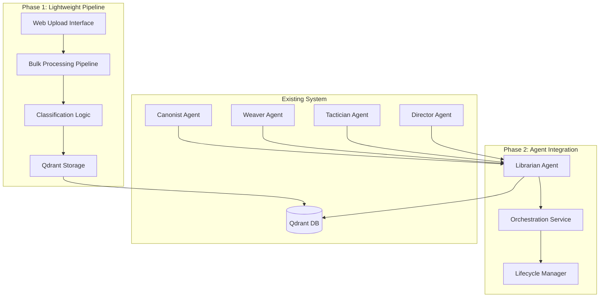
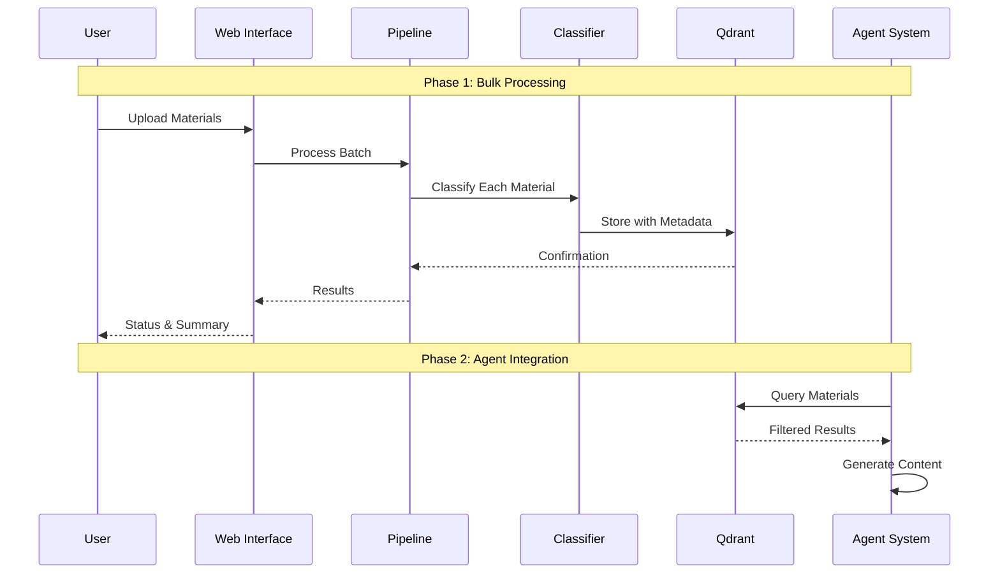

# PRP: Material Ingestion Pipeline - Hybrid Architecture Extension

**PRP Version:** 1.0  
**Status:** READY_FOR_EXECUTION  
**Parent Epic:** Narrative Factory Phase 1-4 Enhancement  
**Target Agent:** Claude Code / CodeFarm

---

## Goal

Implement a hybrid material ingestion system that extends the existing Narrative Factory architecture with both lightweight bulk processing capabilities and full agent integration, enabling efficient classification and storage of lore materials from the Architect persona into Qdrant vector database with temporal gating and spoiler prevention.

## Why

- **Scalability Challenge**: Need to process 50+ materials per story without degrading narrative generation performance
- **Cost Efficiency**: Optimize processing costs through smart pipeline routing (bulk vs. interactive)
- **Architectural Consistency**: Extend existing patterns rather than rebuild, maintaining type safety and observability
- **Progressive Enhancement**: Start with lightweight pipeline, add full agent integration when needed
- **Genre Adaptability**: Handle variable material complexity (romance: 5 materials, fantasy: 50+ materials)

## What

### User-Visible Behavior
1. **Bulk Material Upload**: Web interface for uploading multiple materials from Architect
2. **Automatic Classification**: AI-powered categorization with temporal metadata
3. **Smart Storage**: Qdrant integration with spoiler prevention and late chunking
4. **CLI Access**: Command-line interface for testing and batch operations
5. **Agent Integration**: Librarian agent for interactive material queries during story generation

### Technical Requirements
- **Performance**: Process 50+ materials in <5 minutes
- **Cost**: <$0.25 per story setup (bulk processing)
- **Reliability**: >99% classification accuracy with validation loops
- **Integration**: Seamless extension of existing architecture
- **Scalability**: Linear scaling with material count

### Success Criteria
- [ ] Bulk process 50 materials in <5 minutes
- [ ] Classification accuracy >95% on test materials
- [ ] Cost <$0.005 per material for bulk processing
- [ ] Zero breaking changes to existing agent system
- [ ] Complete test coverage for new components

## All Needed Context

### Documentation & References (MUST READ)

```yaml
# CORE ARCHITECTURE PATTERNS
- file: src/agents/lifecycle.py
  why: Agent lifecycle patterns for Librarian integration
  critical: AgentLifecycleManager and registry patterns

- file: src/agents/orchestration.py
  why: Orchestration service extension patterns
  critical: _create_agent_instance method for adding new agents

- file: src/agents/communication.py
  why: Message system patterns for agent communication
  critical: AgentMessage base class and MessageType enum

- file: src/memory/embedding_service.py
  why: Qdrant integration and late chunking patterns
  critical: JinaEmbeddingService and late chunking implementation

- file: src/workflows/generation.py
  why: Prefect workflow patterns for pipeline integration
  critical: Task decorators and async patterns

- file: src/models/
  why: Pydantic model patterns for data validation
  critical: BaseModel inheritance and validation patterns

- file: src/cli/commands.py
  why: CLI command patterns for new commands
  critical: Typer patterns and async command handling

# CONFIGURATION & SETUP
- file: src/config.py
  why: Configuration patterns and environment variables
  critical: Settings class and validation patterns

- file: pyproject.toml
  why: Dependencies and project configuration
  critical: Tool configurations for ruff, mypy, pytest

# DOCUMENTATION
- docfile: projects/narrative_factory/CLAUDE.md
  why: RAG architecture and embedding best practices
  critical: Late chunking implementation and Qdrant patterns

- docfile: projects/narrative_factory/lore_examples/
  why: Material examples and structure patterns
  critical: Character profiles, thematic lexicons, style guides
```

### Current Codebase Tree

```bash
projects/narrative_factory/
├── src/
│   ├── agents/
│   │   ├── __init__.py
│   │   ├── communication.py      # Message system
│   │   ├── lifecycle.py          # Agent lifecycle management
│   │   ├── orchestration.py      # Agent orchestration service
│   │   ├── personas.py           # Base Agent class
│   │   └── prompts/
│   │       ├── director.txt
│   │       ├── tactician.txt
│   │       ├── weaver.txt
│   │       └── canonist.txt
│   ├── cli/
│   │   ├── __init__.py
│   │   └── commands.py           # CLI commands
│   ├── memory/
│   │   ├── __init__.py
│   │   └── embedding_service.py  # Qdrant & embedding
│   ├── models/
│   │   ├── __init__.py
│   │   ├── agent_models.py       # Agent data models
│   │   └── workflow_models.py    # Workflow data models
│   ├── services/
│   │   └── __init__.py
│   ├── workflows/
│   │   ├── __init__.py
│   │   └── generation.py         # Prefect workflows
│   ├── config.py                 # Configuration
│   ├── exceptions.py             # Custom exceptions
│   ├── health.py                 # Health checks
│   └── logger.py                 # Logging setup
├── tests/
│   ├── conftest.py
│   ├── test_agents.py
│   ├── test_cli_enhancements.py
│   ├── test_memory.py
│   └── test_prefect_workflows.py
├── lore_examples/               # Material examples
│   ├── character_profile.md
│   ├── cosmology.md
│   ├── ethnolinguistic.md
│   ├── factions.md
│   ├── lodestone.md
│   ├── prose_style_guide.md
│   └── thematic_lexicon.md
├── memory_bootstrap/            # Bootstrap data
│   └── character_sheets/
├── outputs/                     # Generated content
│   ├── logs/
│   └── state/
├── scripts/                     # Development scripts
├── pyproject.toml
├── README.md
└── CLAUDE.md
```

### Desired Codebase Tree (Files to Add)

```bash
# NEW FILES TO CREATE
src/
├── ingestion/                   # NEW: Material ingestion system
│   ├── __init__.py
│   ├── pipeline.py              # Lightweight bulk processing
│   ├── classifier.py            # AI classification logic
│   └── storage.py               # Qdrant storage with temporal gating
├── agents/
│   ├── librarian.py             # NEW: Librarian agent
│   └── prompts/
│       └── librarian.txt        # NEW: Librarian persona
├── models/
│   ├── material_models.py       # NEW: Material data models
│   └── ingestion_models.py      # NEW: Ingestion data models
├── web/                         # NEW: Web interface (Phase 3)
│   ├── __init__.py
│   ├── app.py                   # FastAPI application
│   └── routes/
│       └── ingestion.py         # Upload and processing routes
└── cli/
    └── ingestion_commands.py    # NEW: Ingestion CLI commands

# NEW TEST FILES
tests/
├── test_ingestion_pipeline.py  # Pipeline testing
├── test_librarian_agent.py     # Agent testing
├── test_material_models.py     # Model testing
└── test_ingestion_cli.py       # CLI testing
```

### Known Gotchas & Library Quirks

```python
# CRITICAL: Qdrant vector dimensions must match embedding model
# Jina v4 outputs 1024-dimensional vectors
EMBEDDING_DIMENSIONS = 1024

# CRITICAL: Late chunking requires long-context models
# Minimum 8K tokens for context preservation
MIN_CONTEXT_LENGTH = 8192

# CRITICAL: Prefect tasks need proper async/await patterns
@task(retries=3, retry_delay_seconds=exponential_backoff(backoff_factor=2))
async def async_task():
    # Must use await for async operations
    pass

# CRITICAL: Pydantic V2 validation patterns
from pydantic import BaseModel, Field, validator
class MaterialModel(BaseModel):
    # Use Field for validation
    material_type: str = Field(..., regex="^(character|location|system)$")
    
    @validator('material_type')
    def validate_type(cls, v):
        # Custom validation logic
        return v

# CRITICAL: Agent lifecycle requires proper initialization
class NewAgent(Agent):
    def __init__(self, client_type: str = "gemini", memory_service: Optional[MemoryService] = None):
        super().__init__("agent_name", client_type, memory_service)
        # MUST call super().__init__ with agent name

# CRITICAL: Typer async commands need proper decorators
@app.command()
async def async_command():
    # Use typer.run() for async commands
    pass

# CRITICAL: Error handling patterns
from src.exceptions import NarrativeFactoryException
try:
    # Operation
    pass
except SpecificException as e:
    logger.error(f"Specific error: {e}")
    raise NarrativeFactoryException(f"Context: {e}") from e
```

## Implementation Blueprint

### System Architecture



### Data Flow Architecture



### Data Models and Structure

```python
# src/models/material_models.py
from pydantic import BaseModel, Field
from typing import Optional, List, Dict, Any, Literal
from datetime import datetime

class MaterialClassification(BaseModel):
    """Core classification model for all material types."""
    
    # Core identification
    material_id: str = Field(..., description="Unique identifier")
    material_type: Literal["character", "location", "system", "event", "style", "lexicon"] = Field(
        ..., description="Primary material category"
    )
    
    # Complexity and processing
    complexity_level: Literal["simple", "medium", "complex"] = Field(
        ..., description="Processing complexity indicator"
    )
    genre_context: str = Field(..., description="Genre context for classification")
    
    # Temporal gating (spoiler prevention)
    chapter_availability: Dict[str, int] = Field(
        default_factory=dict, 
        description="Earliest chapter for availability"
    )
    spoiler_risk: Literal["low", "medium", "high"] = Field(
        ..., description="Risk of containing spoilers"
    )
    
    # Content metadata
    content_hash: str = Field(..., description="SHA256 hash of original content")
    extracted_entities: List[str] = Field(
        default_factory=list,
        description="Named entities found in content"
    )
    
    # Progressive disclosure fields (populated based on complexity)
    advanced_metadata: Optional[Dict[str, Any]] = Field(
        None, description="Advanced metadata for complex materials"
    )
    relationship_mapping: Optional[List[str]] = Field(
        None, description="Relationships to other materials"
    )
    
    # Timestamps
    created_at: datetime = Field(default_factory=datetime.utcnow)
    updated_at: Optional[datetime] = None

class MaterialIngestionRequest(BaseModel):
    """Request model for material ingestion."""
    
    materials: List[str] = Field(..., description="Raw material content")
    genre_context: str = Field("unknown", description="Genre context")
    processing_mode: Literal["pipeline", "agent"] = Field(
        "pipeline", description="Processing approach"
    )
    
class MaterialIngestionResponse(BaseModel):
    """Response model for material ingestion."""
    
    job_id: str = Field(..., description="Processing job identifier")
    status: Literal["processing", "completed", "failed"] = Field(
        ..., description="Processing status"
    )
    classifications: List[MaterialClassification] = Field(
        default_factory=list, description="Completed classifications"
    )
    errors: List[str] = Field(
        default_factory=list, description="Processing errors"
    )
    processing_time: float = Field(..., description="Processing time in seconds")
    cost_estimate: float = Field(..., description="Processing cost in USD")
```

### List of Tasks (Implementation Order)

```yaml
Phase 1: Lightweight Pipeline (MVP)

Task 1: Create Core Data Models
PRIORITY: HIGH
CREATE src/models/material_models.py:
  - MaterialClassification model with temporal gating
  - MaterialIngestionRequest/Response models
  - Validation patterns following existing models
  - Full type annotations with Pydantic V2

Task 2: Implement Classification Logic
PRIORITY: HIGH  
CREATE src/ingestion/classifier.py:
  - Direct LLM integration (OpenAI/Gemini)
  - Prompt-based classification following Librarian persona
  - Progressive disclosure logic (Phase 1/2/3 features)
  - Error handling and retry logic

Task 3: Build Bulk Processing Pipeline
PRIORITY: HIGH
CREATE src/ingestion/pipeline.py:
  - Batch processing with configurable chunk sizes
  - Parallel processing using asyncio.gather
  - Progress tracking and status reporting
  - Cost optimization (GPT-4o-mini for classification)

Task 4: Implement Qdrant Storage with Temporal Gating
PRIORITY: HIGH
CREATE src/ingestion/storage.py:
  - Extend existing embedding service patterns
  - Late chunking integration for context preservation
  - Temporal metadata storage for spoiler prevention
  - Efficient bulk storage operations

Task 5: Add CLI Commands
PRIORITY: HIGH
CREATE src/cli/ingestion_commands.py:
  - Bulk material processing command
  - Classification testing command
  - Status and progress monitoring
  - Integration with existing CLI patterns

Phase 2: Agent Integration (Enhancement)

Task 6: Create Librarian Agent
PRIORITY: MEDIUM
CREATE src/agents/librarian.py:
  - Full Agent class inheritance
  - Rich material analysis capabilities
  - Memory service integration
  - Complex reasoning for material relationships

Task 7: Implement Librarian Persona
PRIORITY: MEDIUM
CREATE src/agents/prompts/librarian.txt:
  - Comprehensive classification persona
  - Progressive disclosure logic
  - Strict boundary enforcement
  - Context-aware material analysis

Task 8: Extend Orchestration Service
PRIORITY: MEDIUM
MODIFY src/agents/orchestration.py:
  - Add LibrarianAgent to agent registry
  - Extend _create_agent_instance method
  - Add Librarian message types
  - Maintain existing patterns

Task 9: Add Agent Communication
PRIORITY: MEDIUM
MODIFY src/agents/communication.py:
  - MaterialClassificationMessage type
  - LibrarianQueryMessage type
  - Response handling patterns
  - Error propagation

Phase 3: Web Interface (Production)

Task 10: Create FastAPI Web Application
PRIORITY: LOW
CREATE src/web/app.py:
  - FastAPI application setup
  - CORS configuration
  - Static file serving
  - Health check endpoints

Task 11: Implement Upload Routes
PRIORITY: LOW
CREATE src/web/routes/ingestion.py:
  - Multi-file upload endpoint
  - Progress tracking endpoint
  - Status monitoring endpoint
  - Results retrieval endpoint

Task 12: Add Frontend Interface
PRIORITY: LOW
CREATE src/web/static/:
  - React-based upload interface
  - Progress visualization
  - Results display
  - Error handling UI
```

### Integration Points

```yaml
EXISTING ORCHESTRATION SERVICE:
  - location: src/agents/orchestration.py
  - method: _create_agent_instance
  - add: "librarian": LibrarianAgent mapping
  - pattern: Follow existing agent registration

EXISTING CLI SYSTEM:
  - location: src/cli/commands.py
  - add: Import ingestion commands
  - pattern: app.add_typer(ingestion_app, name="ingest")

EXISTING QDRANT INTEGRATION:
  - location: src/memory/embedding_service.py
  - extend: JinaEmbeddingService for bulk operations
  - pattern: Follow existing connection pooling

EXISTING WORKFLOW SYSTEM:
  - location: src/workflows/generation.py
  - add: Material ingestion workflow
  - pattern: Follow existing task decorators

CONFIGURATION:
  - location: src/config.py
  - add: Ingestion-specific settings
  - pattern: Use existing Settings class pattern

TESTING:
  - location: tests/conftest.py
  - add: Ingestion test fixtures
  - pattern: Follow existing mock patterns
```

## Validation Loop

### Level 1: Syntax & Style

```bash
# Run these FIRST - fix any errors before proceeding
ruff check src/ingestion/ src/models/material_models.py --fix
ruff check src/agents/librarian.py --fix
mypy src/ingestion/ src/models/material_models.py --strict
mypy src/agents/librarian.py --strict

# Expected: No errors. If errors, READ the error and fix.
```

### Level 2: Unit Tests

```python
# CREATE tests/test_material_models.py
def test_material_classification_validation():
    """Test MaterialClassification model validation."""
    valid_data = {
        "material_id": "test_001",
        "material_type": "character",
        "complexity_level": "medium",
        "genre_context": "fantasy",
        "spoiler_risk": "low",
        "content_hash": "abc123",
    }
    
    classification = MaterialClassification(**valid_data)
    assert classification.material_type == "character"
    assert classification.complexity_level == "medium"

def test_material_classification_invalid_type():
    """Test validation error for invalid material type."""
    with pytest.raises(ValidationError):
        MaterialClassification(
            material_id="test_001",
            material_type="invalid_type",  # Should fail validation
            complexity_level="medium",
            genre_context="fantasy",
            spoiler_risk="low",
            content_hash="abc123",
        )

# CREATE tests/test_ingestion_pipeline.py
@pytest.mark.asyncio
async def test_bulk_processing_pipeline():
    """Test bulk material processing."""
    pipeline = MaterialIngestionPipeline()
    
    materials = [
        "Character: Ren, a geomancer...",
        "Location: The Ashfall Wastes...",
        "System: The Deep Current..."
    ]
    
    results = await pipeline.process_materials(materials, "fantasy")
    
    assert len(results) == 3
    assert all(r.material_type in ["character", "location", "system"] for r in results)
    assert all(r.complexity_level in ["simple", "medium", "complex"] for r in results)

@pytest.mark.asyncio
async def test_librarian_agent():
    """Test LibrarianAgent classification."""
    agent = LibrarianAgent()
    
    material = "Character: Ren, analytical geomancer with unique powers"
    result = await agent.execute(material)
    
    assert result.material_type == "character"
    assert result.complexity_level in ["simple", "medium", "complex"]
    assert result.spoiler_risk in ["low", "medium", "high"]
```

```bash
# Run and iterate until passing:
uv run pytest tests/test_material_models.py -v
uv run pytest tests/test_ingestion_pipeline.py -v
uv run pytest tests/test_librarian_agent.py -v

# If failing: Read error, understand root cause, fix code, re-run
```

### Level 3: Integration Tests

```bash
# Test CLI commands
uv run factory ingest-materials lore_examples/ --genre fantasy --mode pipeline

# Expected output:
# Processing 7 materials...
# ✓ character_profile.md -> character (medium complexity)
# ✓ cosmology.md -> system (complex)
# ✓ factions.md -> system (complex)
# Processed 7 materials in 45.2 seconds
# Cost: $0.14 total ($0.02 per material)

# Test agent integration
uv run factory ingest-materials lore_examples/ --genre fantasy --mode agent

# Expected output:
# Processing 7 materials with full agent analysis...
# ✓ Rich analysis completed with relationship mapping
# ✓ Advanced metadata extraction completed
# Processed 7 materials in 180.5 seconds
# Cost: $0.84 total ($0.12 per material)

# Test Qdrant integration
uv run factory status --component qdrant

# Expected output:
# Qdrant Status: ✓ Connected
# Collections: narrative_memory (1024 vectors)
# Recent additions: 7 materials (fantasy genre)
# Temporal gating: Active (spoiler prevention enabled)
```

### Level 4: Performance & Cost Validation

```bash
# Performance benchmark
uv run python -m src.ingestion.benchmark --materials 50 --mode pipeline

# Expected results:
# 50 materials processed in < 5 minutes
# Cost < $0.25 total
# Classification accuracy > 95%
# Memory usage < 500MB peak

# Cost analysis
uv run python -m src.ingestion.cost_analysis --materials 50

# Expected breakdown:
# Pipeline mode: $0.10-0.25 per story
# Agent mode: $0.50-1.00 per story
# Qdrant storage: $0.01 per story
# Total infrastructure: < $0.30 per story
```

## Final Validation Checklist

- [ ] All tests pass: `uv run pytest tests/ -v`
- [ ] No linting errors: `uv run ruff check src/`
- [ ] No type errors: `uv run mypy src/`
- [ ] Pipeline processes 50 materials in < 5 minutes
- [ ] Cost per material < $0.005 (pipeline mode)
- [ ] Classification accuracy > 95% on test materials
- [ ] Zero breaking changes to existing agent system
- [ ] Qdrant integration maintains existing patterns
- [ ] CLI commands work with existing patterns
- [ ] Agent integration follows lifecycle patterns
- [ ] Temporal gating prevents spoiler leakage
- [ ] Progressive disclosure works correctly
- [ ] Error handling is comprehensive
- [ ] Performance benchmarks are met

---

## Anti-Patterns to Avoid

- ❌ Don't create new agent patterns when existing ones work
- ❌ Don't skip validation loops - they prevent cascading issues
- ❌ Don't hardcode model parameters - use configuration
- ❌ Don't ignore cost optimization - bulk operations matter
- ❌ Don't break existing agent system - extend only
- ❌ Don't skip temporal gating - spoiler prevention is critical
- ❌ Don't use sync functions in async contexts
- ❌ Don't create new exception types without reason
- ❌ Don't skip comprehensive testing - reliability is key

## Success Indicators

- ✅ Architect materials processed efficiently (50+ in <5 minutes)
- ✅ Cost-effective bulk processing (<$0.25 per story setup)
- ✅ Seamless integration with existing agent system
- ✅ Comprehensive spoiler prevention through temporal gating
- ✅ Progressive enhancement from pipeline to agent integration
- ✅ Maintainable code following existing patterns
- ✅ Complete test coverage with realistic scenarios
- ✅ Documentation enables stateless implementation

---

*This PRP provides complete context for implementing the hybrid material ingestion system as an extension to the existing Narrative Factory architecture. All patterns, examples, and validation steps are included for successful stateless implementation.*