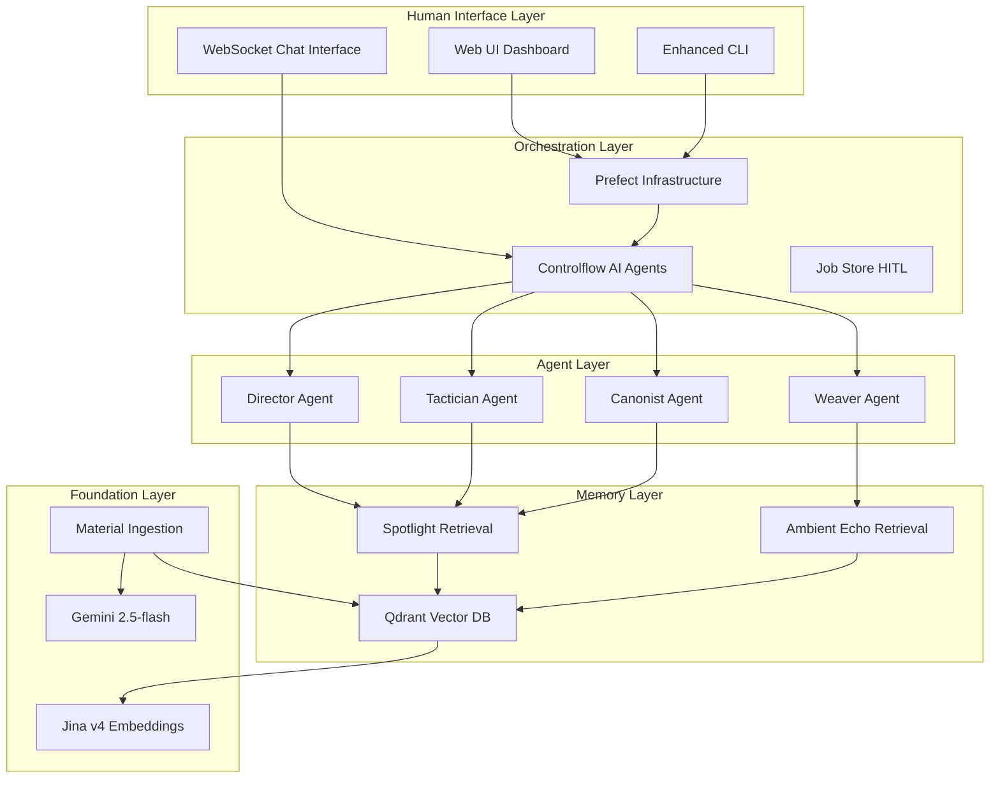

name: "Phase 5: Advanced Orchestration - Hybrid Prefect + Controlflow Architecture"
description: |

## Purpose
Generate comprehensive implementation plan for transforming the Narrative Factory from basic Prefect workflows into a sophisticated hybrid orchestration system using Controlflow for AI agent collaboration while maintaining Prefect for infrastructure management.

## Philosophy
1. **Research First**: Leverage completed research on Prefect, Controlflow, and Qdrant
2. **Evolutionary Enhancement**: Build on existing working foundation rather than replacement
3. **Validation Built-in**: Each component includes testable success criteria
4. **Production Ready**: Focus on scalable, observable, maintainable architecture

---

## Initial Concept

Transform the Narrative Factory into a production-ready AI narrative generation platform by implementing:

1. **Hybrid Orchestration**: Controlflow for AI agent collaboration + Prefect for infrastructure
2. **Advanced Memory Architecture**: Two-tier context retrieval (Spotlight + Ambient Echo)  
3. **Human-in-the-Loop Interfaces**: Real-time chat and monitoring dashboards
4. **Production Optimization**: Performance, deployment, and scaling readiness

## Planning Process

### Phase 1: Current State Analysis ✅ COMPLETE

#### Context Gathering ✅
```yaml
research_completed:
  prefect_capabilities:
    - workflow_orchestration: "Infrastructure management, retry logic, observability"
    - ai_ml_features: "Model lifecycle, hyperparameter tuning, LLM pipelines"
    - enterprise_features: "RBAC, audit logging, multi-environment deployment"
    - integration_points: "Native Python, async support, transaction workflows"
  
  controlflow_capabilities:
    - ai_agent_orchestration: "Multi-agent collaboration, structured outputs"
    - prefect_integration: "Built on Prefect 3.0, seamless compatibility"
    - advanced_features: "Interactive sessions, tool integration, session replay"
    - collaboration_patterns: "Round-robin, moderated, delegation strategies"
  
  qdrant_implementation:
    - production_patterns: "Payload indexing, connection pooling, error handling"
    - two_tier_architecture: "Spotlight + Ambient Echo retrieval strategy"
    - performance_optimization: "Batch operations, health monitoring, late chunking"
    - narrative_specific: "Character filtering, thread tracking, tension monitoring"

current_system_status:
  phase_1_blockers: "ALL RESOLVED ✅"
  working_components:
    - material_ingestion: "LitRPG genre tested successfully"
    - agent_workflows: "Director → Tactician → Weaver → Canonist operational"
    - memory_retrieval: "Qdrant with payload indexes functional"
    - human_approval: "Job store workflows operational"
  
  validated_patterns:
    - async_execution: "Agent.execute() properly awaited"
    - vector_storage: "Collections and indexes created"
    - type_safety: "Pydantic models with ~10 MyPy warnings remaining"
    - end_to_end: "Complete workflow tested with dry run"
```

#### Technical Research ✅
```yaml
integration_architecture:
  hybrid_approach:
    prefect_responsibilities:
      - infrastructure_orchestration: "Resource allocation, monitoring, deployment"
      - retry_logic: "Robust error handling and recovery"
      - observability: "Logging, metrics, tracing"
      - human_approval: "Job store and approval workflows"
    
    controlflow_responsibilities:
      - agent_collaboration: "Multi-agent conversation and decision making"
      - structured_outputs: "Type-safe agent results with Pydantic"
      - interactive_sessions: "Real-time human-agent collaboration"
      - tool_integration: "Memory access, character analysis, context retrieval"

  memory_architecture:
    two_tier_system:
      spotlight_tier:
        purpose: "High-relevance immediate context"
        filters: "present_characters matching current POV"
        threshold: "0.7-0.8 relevance score"
        limit: "5-10 results for focused attention"
      
      ambient_echo_tier:
        purpose: "Background story state and off-screen developments"
        filters: "tension_status unresolved/escalating"
        threshold: "0.3-0.5 relevance score"  
        limit: "10-20 results for comprehensive background"

  interface_strategy:
    websocket_chat:
      purpose: "Real-time agent conversation monitoring"
      features: "Human intervention, approval workflows, agent steering"
    
    monitoring_dashboard:
      purpose: "Workflow status and performance monitoring"
      features: "Agent health, memory utilization, narrative progress"
```

### Phase 2: Architectural Design

#### System Architecture Diagram


#### Component Integration Strategy

**1. Controlflow Agent Wrapper Pattern**
```python
# Convert existing agents to Controlflow format
class NarrativeDirectorAgent(cf.Agent):
    def __init__(self):
        super().__init__(
            name="NarrativeDirector",
            instructions=self._load_persona("director"),
            tools=[
                memory_context_tool,
                catalyst_injection_tool,
                character_analysis_tool
            ]
        )
    
    def _load_persona(self, persona_name: str) -> str:
        # Existing persona loading logic
        return load_persona_from_file(persona_name)

# Multi-agent collaboration workflow
@cf.flow
def narrative_collaboration_flow(chapter_seed: str):
    director_brief = cf.run(
        "Create strategic narrative brief",
        agents=[director_agent],
        context=dict(seed=chapter_seed)
    )
    
    tactician_plan = cf.run(
        "Develop detailed chapter blueprint", 
        agents=[tactician_agent],
        context=dict(brief=director_brief)
    )
    
    return tactician_plan
```

**2. Hybrid Prefect-Controlflow Bridge**
```python
# Prefect orchestrates infrastructure + human approval
@flow(name="Hybrid Narrative Generation")
async def hybrid_narrative_flow(chapter_seed: str):
    # Controlflow handles AI agent collaboration
    agent_results = await controlflow_narrative_task(chapter_seed)
    
    # Prefect handles human approval workflow
    approved_results = await human_approval_task(agent_results)
    
    # Continue with approved input
    final_output = await finalization_task(approved_results)
    
    return final_output

@task
async def controlflow_narrative_task(chapter_seed: str):
    # Execute Controlflow agent workflow
    return narrative_collaboration_flow(chapter_seed)
```

**3. Two-Tier Memory Integration**
```python
# Enhanced memory tools for Controlflow agents
def spotlight_memory_tool(query: str, characters: List[str]) -> Dict[str, Any]:
    """Retrieve high-relevance narrative context"""
    return memory_service.spotlight_retrieval(
        query_text=query,
        active_characters=characters,
        score_threshold=0.7
    )

def ambient_memory_tool(query: str, exclude_ids: List[str]) -> Dict[str, Any]:
    """Retrieve background narrative context"""
    return memory_service.ambient_echo_retrieval(
        query_text=query,
        exclude_spotlight_ids=exclude_ids,
        score_threshold=0.3
    )

# Agents equipped with memory tools
director = cf.Agent(
    name="Director",
    tools=[spotlight_memory_tool, ambient_memory_tool, catalyst_injection]
)
```

### Phase 3: Implementation Roadmap

#### Timeline: 6-8 Weeks (Small Team) / 12-16 Weeks (Single Developer)

```yaml
phase_2a_foundation: # Weeks 1-2
  tasks:
    - controlflow_agent_wrappers:
        effort: "3-4 days"
        description: "Convert existing Agent classes to Controlflow format"
        validation: "Agent collaboration workflows functional"
    
    - memory_tier_separation:
        effort: "4-5 days" 
        description: "Implement spotlight vs ambient retrieval logic"
        validation: "Two-tier context fusion operational"
    
    - enhanced_cli_interfaces:
        effort: "2-3 days"
        description: "Add real-time workflow monitoring commands"
        validation: "CLI can monitor agent interactions"

phase_2b_integration: # Weeks 3-4
  tasks:
    - hybrid_orchestration:
        effort: "5-6 days"
        description: "Bridge Prefect infrastructure with Controlflow agents"
        validation: "End-to-end hybrid workflows functional"
    
    - context_fusion_engine:
        effort: "4-5 days"
        description: "Intelligent combination of spotlight + ambient context"
        validation: "Agents receive comprehensive narrative context"
    
    - websocket_foundation:
        effort: "4-5 days"
        description: "Real-time agent conversation interfaces"
        validation: "Live monitoring of agent interactions"

phase_2c_optimization: # Weeks 5-6
  tasks:
    - performance_tuning:
        effort: "3-4 days"
        description: "Caching, batching, resource optimization"
        validation: "Sub-2-second agent response times"
    
    - monitoring_dashboards:
        effort: "4-5 days"
        description: "Agent health, workflow status, memory metrics"
        validation: "Complete system observability"
    
    - production_deployment:
        effort: "3-4 days"
        description: "Container deployment, scaling, reliability"
        validation: "Production-ready deployment"
```

## Success Criteria

### **Technical Milestones**
- [ ] All existing agents converted to Controlflow format with tools
- [ ] Multi-agent collaboration workflows operational
- [ ] Two-tier memory architecture providing rich context
- [ ] Hybrid Prefect-Controlflow orchestration functional
- [ ] WebSocket interfaces for real-time monitoring
- [ ] Performance optimized for production scale
- [ ] Complete observability and monitoring

### **User Experience Goals**
- [ ] Narrative generation quality improved through agent collaboration
- [ ] Human-in-the-loop workflows streamlined and responsive
- [ ] Real-time visibility into agent decision-making process  
- [ ] Intuitive interfaces for narrative iteration and refinement
- [ ] Reliable, fast, and scalable narrative production

### **Production Readiness**
- [ ] Container deployment with orchestration
- [ ] Monitoring and alerting for all components
- [ ] Performance benchmarks and optimization
- [ ] Security and access control implementation
- [ ] Documentation and runbook completion

## All Needed Context

### Documentation & References
```yaml
research_documentation:
  - file: "/workspaces/PRPs-agentic-eng/projects/narrative_factory/docs/research/PREFECT_RESEARCH_SUMMARY.md"
    why: "Complete Prefect capabilities and integration patterns"
    
  - file: "/workspaces/PRPs-agentic-eng/projects/narrative_factory/docs/research/CONTROLFLOW_RESEARCH_SUMMARY.md"  
    why: "Controlflow agent orchestration patterns and API"
    
  - file: "/workspaces/PRPs-agentic-eng/projects/narrative_factory/docs/research/QDRANT_IMPLEMENTATION_GUIDE.md"
    why: "Production-ready vector database patterns and two-tier architecture"
    
  - file: "/workspaces/PRPs-agentic-eng/projects/narrative_factory/docs/research/PHASE1_COMPLETION_STATUS.md"
    why: "Current working state and validated components"

existing_codebase_patterns:
  - file: "src/agents/personas.py"
    why: "Current agent implementation patterns to preserve"
    
  - file: "src/workflows/generation.py" 
    why: "Working Prefect flows to enhance, not replace"
    
  - file: "src/memory/qdrant.py"
    why: "Operational memory service with indexes and connection pooling"
    
  - file: "src/models/material_models.py"
    why: "Type-safe Pydantic models for agent inputs/outputs"

validation_commands:
  - command: "uv run factory --help"
    why: "Verify CLI functionality maintained"
    
  - command: "uv run pytest tests/ -v"
    why: "Ensure no regressions in existing functionality"
    
  - command: "uv run python -c 'import asyncio; from src.workflows.generation import initial_generation_flow; print(asyncio.run(initial_generation_flow(\"Test\", dry_run=True)))'"
    why: "Validate end-to-end agent workflow execution"
```

### Critical Implementation Insights
```yaml
architectural_decisions:
  hybrid_approach_rationale: |
    Don't replace Prefect with Controlflow - enhance Prefect WITH Controlflow.
    Prefect excels at infrastructure, monitoring, deployment, scaling.
    Controlflow excels at AI agent collaboration, structured outputs, interactive sessions.
    Together they create a best-of-both-worlds architecture.

  controlflow_integration_strategy: |
    Controlflow is built ON Prefect 3.0, so integration is natural.
    Use Controlflow @cf.flow decorators WITHIN Prefect @task functions.
    This allows Prefect to manage infrastructure while Controlflow handles agent logic.

  memory_architecture_enhancement: |
    Two-tier retrieval prevents "protagonist tunnel vision" common in AI storytelling.
    Spotlight tier: immediate scene context for active characters.
    Ambient Echo tier: background story state and off-screen developments.
    Context fusion provides comprehensive narrative awareness.

performance_considerations:
  agent_response_times: "Target <2 seconds for agent collaboration workflows"
  memory_retrieval: "Parallel spotlight + ambient queries for optimal performance"  
  caching_strategy: "Cache agent personas, memory contexts, and embedding results"
  resource_optimization: "Use connection pooling, batch operations, async patterns"

testing_strategies:
  unit_testing: "Test individual agent wrappers and memory tools"
  integration_testing: "Test hybrid Prefect-Controlflow workflows"
  performance_testing: "Benchmark agent collaboration and memory retrieval"
  user_acceptance: "Validate human-in-the-loop interfaces with real scenarios"
```

## Implementation Blueprint

### **Task Breakdown Structure**

**Epic 1: Controlflow Agent Integration (T01)**
```yaml
description: "Convert existing agents to Controlflow format with tool integration"
tasks:
  - agent_wrapper_creation: "DirectorAgent, TacticianAgent, WeaverAgent, CanonistAgent"
  - tool_integration: "Memory retrieval, character analysis, catalyst injection"
  - collaboration_patterns: "Multi-agent workflows with shared context"
  - testing_validation: "Agent interaction and output validation"
effort: "15-19 days"
prerequisites: "Phase 1 completion (✅ DONE)"
```

**Epic 2: Two-Tier Memory Architecture (T02)**  
```yaml
description: "Implement sophisticated context retrieval with spotlight + ambient tiers"
tasks:
  - tier_separation_logic: "Spotlight vs ambient query strategies"
  - context_fusion_engine: "Intelligent combination of memory tiers"
  - memory_passport_system: "Enhanced metadata for narrative tracking"
  - performance_optimization: "Caching, batching, connection pooling"
effort: "16-21 days"
prerequisites: "Qdrant indexes created (✅ DONE)"
```

**Epic 3: Human-in-the-Loop Interfaces (T03)**
```yaml
description: "Build real-time monitoring and chat interfaces"
tasks:
  - websocket_chat_interface: "Real-time agent conversation monitoring"
  - workflow_monitoring_dashboard: "Agent health, status, performance metrics"
  - approval_interface_enhancement: "Rich feedback and iteration workflows"
  - integration_testing: "End-to-end user experience validation"
effort: "19-25 days"  
prerequisites: "FastAPI foundation (✅ DONE)"
```

**Epic 4: Production Optimization (T04)**
```yaml
description: "Performance tuning, deployment, and scaling readiness"
tasks:
  - performance_benchmarking: "Agent response times, memory retrieval speed"
  - container_deployment: "Docker, orchestration, scaling patterns"
  - monitoring_alerting: "Observability for all system components"
  - documentation_runbooks: "Operational guides and troubleshooting"
effort: "12-16 days"
prerequisites: "Core functionality complete"
```

### **Validation Loop**

#### Level 1: Component Validation
```bash
# Agent wrapper functionality
uv run python -c "
import controlflow as cf
from src.agents.enhanced_personas import NarrativeDirectorAgent
director = NarrativeDirectorAgent()
result = cf.run('Create a brief for testing', agents=[director])
print('✅ Agent wrapper:', type(result))
"

# Memory tier separation
uv run python -c "
import asyncio
from src.memory.enhanced_qdrant import TwoTierMemoryService
service = TwoTierMemoryService()
context = asyncio.run(service.fetch_narrative_context('Test', ['char1']))
print('✅ Memory tiers:', len(context.spotlight_context), len(context.ambient_context))
"
```

#### Level 2: Integration Validation
```bash
# Hybrid orchestration
uv run python -c "
import asyncio
from src.workflows.hybrid_generation import hybrid_narrative_flow
result = asyncio.run(hybrid_narrative_flow('Test chapter seed', dry_run=True))
print('✅ Hybrid workflow:', result['status'])
"

# WebSocket interface
curl -X GET http://localhost:8000/agent-status
# Expected: JSON with agent health and status information
```

#### Level 3: Production Validation
```bash
# Performance benchmarking
uv run python benchmark_script.py
# Expected: <2 second agent response times

# End-to-end workflow
uv run factory generate --seed "A mysterious figure approaches" --mode production
# Expected: Complete narrative generation with monitoring
```

## Gotchas and Edge Cases

### **Controlflow Integration Challenges**
- **Session Management**: Controlflow sessions need proper cleanup to avoid memory leaks
- **Error Propagation**: Ensure Controlflow agent errors propagate correctly to Prefect
- **Tool Serialization**: Agent tools must be properly serializable for distributed execution

### **Memory Architecture Pitfalls**
- **Context Explosion**: Too much ambient context can overwhelm agents - implement smart filtering
- **Consistency Issues**: Ensure spotlight and ambient queries maintain narrative consistency
- **Performance Bottlenecks**: Two-tier retrieval can be slow - implement parallel execution

### **Human Interface Complexity**
- **WebSocket State**: Maintain proper connection state across agent interactions
- **Real-time Updates**: Handle high-frequency agent updates without overwhelming UI
- **Session Persistence**: Maintain conversation state across disconnections

### **Production Deployment Risks**  
- **Resource Scaling**: Agent workflows can be resource-intensive - implement proper limits
- **Error Recovery**: Ensure graceful degradation when components fail
- **Security Boundaries**: Protect agent conversations and narrative content

## Next Actions

### **Immediate (Post-Refeed)**
1. Read all research documentation to restore context
2. Validate Phase 1 completion status  
3. Review tactical PRP files for detailed implementation

### **Phase 2A Start (Week 1)**
1. Begin Controlflow agent wrapper creation (T01)
2. Start memory tier separation implementation (T02)
3. Set up development environment for hybrid architecture

### **Parallel Development Tracks**
- **Track 1**: Controlflow integration (Developer A)
- **Track 2**: Memory architecture enhancement (Developer B)  
- **Track 3**: Human interface development (Developer C)

**The Narrative Factory is ready for its transformation into a production-grade AI narrative orchestration platform!** 🚀

---

This planning PRP provides the complete roadmap for Phase 2+3 implementation with all necessary context preserved and actionable next steps defined.